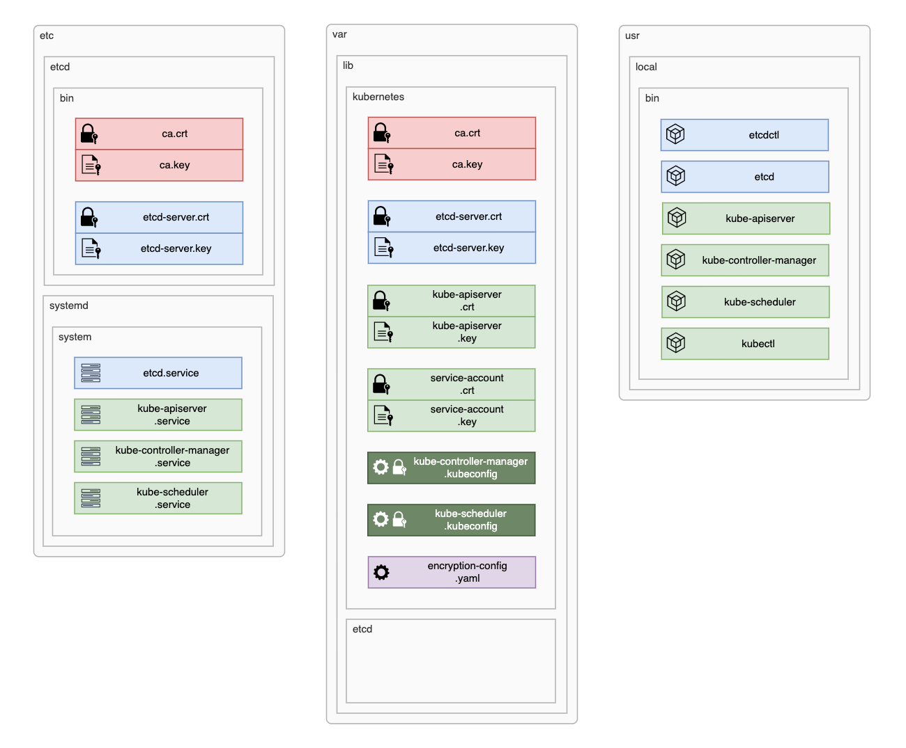

# Bootstrapping the control plane components

- [Bootstrap the etcd cluster](#bootstrap-the-etcd-cluster)
  - [Install binaries](#install-binaries)
  - [Copy certificates and configure the systemd unit file](#copy-certificates-and-configure-the-systemd-unit-file)
  - [Start and test the etcd service](#start-and-test-the-etcd-service)
- [Bootstrap the main kubernetes components](#bootstrap-the-main-kubernetes-components)
  - [Install binaries](#install-binaries-1)
  - [Copy certificates and configure the systemd unit file](#copy-certificates-and-configure-the-systemd-unit-file-1)
  - [Start and test the kubernetes service](#start-and-test-the-kubernetes-service)
- [Configure the load balancer](#configure-the-load-balancer)
  - [Install binaries and configuration file](#install-binaries-and-configuration-file)
  - [Start and test the service](#start-and-test-the-service)
  - [Authorise kubectl for remote access (optional)](#authorise-kubectl-for-remote-access-optional)
  - [Configure kube-apiserver to kubelet connectivity](#configure-kube-apiserver-to-kubelet-connectivity)

In this section we will install and configure all components on the control plane which involves the master nodes as well as the load balancer. First we will configure and test the etcd cluster, followed by the three main kubernetes components, setting up a configuration to handle the api-server connectivity to kubelets and finally, we will configure `haproxy` on the load balancer to split the traffic between the two api-servers.

## Bootstrap the etcd cluster



The etcd cluster requires files to be installed in several locations:

    /etc/etcd/
      etcd-server.crt     - signed certificate
      etcd-server.key     - private key
      ca.crt              - CA certificate

    /etc/systemd/system
      etcd.service        - systemd service unit file

    /user/local/bin
      etcd                - etcd binary
      etcdctl             - etcd cli utility

    /var/lib/etcd         - data directory

### Install binaries

    MASTER NODES ↴

```bash
{
cd ~

# Create the required folders to store configuration and data
sudo mkdir -p /etc/etcd
sudo mkdir -p /var/lib/etcd

# Download binaries from original repository
wget -q --show-progress --https-only --timestamping \
  "https://github.com/coreos/etcd/releases/download/v3.3.9/etcd-v3.3.9-linux-amd64.tar.gz"

# Unpack and move to /usr/local/bin
tar -xvf etcd-v3.3.9-linux-amd64.tar.gz
sudo mv etcd-v3.3.9-linux-amd64/etcd* /usr/local/bin/
rm -rf etcd-v3.3.9-linux-amd64*

}
```

### Copy certificates and configure the systemd unit file

    MASTER NODES ↴

    Generates: etcd.service

```bash
{
cd ~

# Configuration variables for the cluster
NODE_HOSTNAME=$(hostname -s)
NODE_IP=$(hostname -I | awk '{ print $2 }')
MASTER_1_IP="192.168.2.11"
MASTER_2_IP="192.168.2.12"

# Generate the systemd unit file
cat > etcd.service <<EOF
[Unit]
Description=etcd
Documentation=https://github.com/coreos

[Service]
ExecStart=/usr/local/bin/etcd \\
  --name ${NODE_HOSTNAME} \\
  --cert-file=/etc/etcd/etcd-server.crt \\
  --key-file=/etc/etcd/etcd-server.key \\
  --peer-cert-file=/etc/etcd/etcd-server.crt \\
  --peer-key-file=/etc/etcd/etcd-server.key \\
  --trusted-ca-file=/etc/etcd/ca.crt \\
  --peer-trusted-ca-file=/etc/etcd/ca.crt \\
  --peer-client-cert-auth \\
  --client-cert-auth \\
  --initial-advertise-peer-urls https://${NODE_IP}:2380 \\
  --listen-peer-urls https://${NODE_IP}:2380 \\
  --listen-client-urls https://${NODE_IP}:2379,https://127.0.0.1:2379 \\
  --advertise-client-urls https://${NODE_IP}:2379 \\
  --initial-cluster-token etcd-cluster-0 \\
  --initial-cluster master-1=https://${MASTER_1_IP}:2380,master-2=https://${MASTER_2_IP}:2380 \\
  --initial-cluster-state new \\
  --data-dir=/var/lib/etcd
Restart=on-failure
RestartSec=5

[Install]
WantedBy=multi-user.target
EOF

# Move the service file to /etc/systemd/system/
sudo mv etcd.service /etc/systemd/system

# Copy the certificates to /etc/etcd
cd ~/share
sudo cp etcd-server.crt etcd-server.key ca.crt ca.key /etc/etcd/
}
```

### Start and test the etcd service

    MASTER NODES ↴

```bash
{
sudo systemctl daemon-reload
sudo systemctl enable etcd
sudo systemctl restart etcd

sleep 5

sudo ETCDCTL_API=3 etcdctl member list \
  --endpoints=https://127.0.0.1:2379 \
  --cacert=/etc/etcd/ca.crt \
  --cert=/etc/etcd/etcd-server.crt \
  --key=/etc/etcd/etcd-server.key
}
```

## Bootstrap the main kubernetes components


The Kubernetes Control Plane requires files to be installed in several locations:

    /etc/systemd/system
      kube-apiserver.service              - systemd service unit file
      kube-controller-manager.service     - systemd service unit file
      kube-scheduler.service              - systemd service unit file

    /user/local/bin
      kube-apiserver                      - binary file
      kube-controller-manager             - binary file
      kube-scheduler                      - binary file
      kubectl                             - Kubernetes CLI utiltiy

    /var/lib/kubernetes
      ca.crt                              - CA certificate
      ca.key                              - CA private key
      etcd-server.crt                     - etcd cluster signed certificate
      etcd-server.key                     - etcd cluster private key
      kube-apiserver.crt                  - kube-apiserver signed certificate
      kube-apiserver.key                  - kube-apiserver private key
      service-account.crt                 - signed certificate used for encryption
      service-account.key                 - private key used for encryption

      kube-controller-manager.kubeconfig  - kube-controller-manager configuration file
      kube-scheduler.kubeconfig           - kube-scheduler configuration file
      encryption-config.yaml              - service account configuration file

### Install binaries

    MASTER NODES ↴

```bash
{
cd ~

# Create the required folders to store configuration and data
sudo mkdir -p /var/lib/kubernetes/


# Download binaries from original repository
wget -q --show-progress --https-only --timestamping \
  "https://storage.googleapis.com/kubernetes-release/release/v1.13.0/bin/linux/amd64/kube-apiserver" \
  "https://storage.googleapis.com/kubernetes-release/release/v1.13.0/bin/linux/amd64/kube-controller-manager" \
  "https://storage.googleapis.com/kubernetes-release/release/v1.13.0/bin/linux/amd64/kube-scheduler" \


# Unpack and move to /usr/local/bin
chmod +x kube-apiserver kube-controller-manager kube-scheduler
sudo mv kube-apiserver kube-controller-manager kube-scheduler /usr/local/bin/

}
```

### Copy certificates and configure the systemd unit file

    MASTER NODES ↴

    Generates: kube-apiserver.service, kube-contoller-manager.service, kube-scheduler.sevice

```bash
{
cd ~/share

# Cluster configuration variables
NODE_IP=$(hostname -I | awk '{ print $2 }')
MASTER_1_IP="192.168.2.11"
MASTER_2_IP="192.168.2.12"
CLUSTER_CIDR="192.168.2.0/24"


# Copy certificates and configration files to their location
sudo cp \
  ca.crt ca.key \
  etcd-server.crt etcd-server.key \
  kube-apiserver.crt kube-apiserver.key \
  service-account.crt service-account.key \
  kube-controller-manager.kubeconfig \
  kube-scheduler.kubeconfig \
  encryption-config.yaml \
  /var/lib/kubernetes\


# Generate kube-api.service systemd unit file
cat <<EOF | sudo tee /etc/systemd/system/kube-apiserver.service
[Unit]
Description=Kubernetes API Server
Documentation=https://github.com/kubernetes/kubernetes

[Service]
ExecStart=/usr/local/bin/kube-apiserver \\
  --advertise-address=${NODE_IP} \\
  --allow-privileged=true \\
  --apiserver-count=3 \\
  --audit-log-maxage=30 \\
  --audit-log-maxbackup=3 \\
  --audit-log-maxsize=100 \\
  --audit-log-path=/var/log/audit.log \\
  --authorization-mode=Node,RBAC \\
  --bind-address=0.0.0.0 \\
  --client-ca-file=/var/lib/kubernetes/ca.crt \\
  --enable-admission-plugins=NodeRestriction,ServiceAccount \\
  --enable-swagger-ui=true \\
  --enable-bootstrap-token-auth=true \\
  --etcd-cafile=/var/lib/kubernetes/ca.crt \\
  --etcd-certfile=/var/lib/kubernetes/etcd-server.crt \\
  --etcd-keyfile=/var/lib/kubernetes/etcd-server.key \\
  --etcd-servers=https://${MASTER_1_IP}:2379,https://${MASTER_2_IP}:2379 \\
  --event-ttl=1h \\
  --encryption-provider-config=/var/lib/kubernetes/encryption-config.yaml \\
  --kubelet-certificate-authority=/var/lib/kubernetes/ca.crt \\
  --kubelet-client-certificate=/var/lib/kubernetes/kube-apiserver.crt \\
  --kubelet-client-key=/var/lib/kubernetes/kube-apiserver.key \\
  --kubelet-https=true \\
  --runtime-config=api/all \\
  --service-account-key-file=/var/lib/kubernetes/service-account.crt \\
  --service-cluster-ip-range=10.96.0.0/24 \\
  --service-node-port-range=30000-32767 \\
  --tls-cert-file=/var/lib/kubernetes/kube-apiserver.crt \\
  --tls-private-key-file=/var/lib/kubernetes/kube-apiserver.key \\
  --v=2
Restart=on-failure
RestartSec=5

[Install]
WantedBy=multi-user.target
EOF


# Generate kube-controller-manager.service systemd unit file
cat <<EOF | sudo tee /etc/systemd/system/kube-controller-manager.service
[Unit]
Description=Kubernetes Controller Manager
Documentation=https://github.com/kubernetes/kubernetes

[Service]
ExecStart=/usr/local/bin/kube-controller-manager \\
  --address=0.0.0.0 \\
  --cluster-cidr=${CLUSTER_CIDR} \\
  --cluster-name=kubernetes \\
  --cluster-signing-cert-file=/var/lib/kubernetes/ca.crt \\
  --cluster-signing-key-file=/var/lib/kubernetes/ca.key \\
  --kubeconfig=/var/lib/kubernetes/kube-controller-manager.kubeconfig \\
  --leader-elect=true \\
  --root-ca-file=/var/lib/kubernetes/ca.crt \\
  --service-account-private-key-file=/var/lib/kubernetes/service-account.key \\
  --service-cluster-ip-range=10.96.0.0/24 \\
  --use-service-account-credentials=true \\
  --v=2
Restart=on-failure
RestartSec=5

[Install]
WantedBy=multi-user.target
EOF


# Generate kube-scheduler.service systemd unit file
cat <<EOF | sudo tee /etc/systemd/system/kube-scheduler.service
[Unit]
Description=Kubernetes Scheduler
Documentation=https://github.com/kubernetes/kubernetes

[Service]
ExecStart=/usr/local/bin/kube-scheduler \\
  --kubeconfig=/var/lib/kubernetes/kube-scheduler.kubeconfig \\
  --address=127.0.0.1 \\
  --leader-elect=true \\
  --v=2
Restart=on-failure
RestartSec=5

[Install]
WantedBy=multi-user.target
EOF

}
```

### Start and test the kubernetes service

    MASTER NODES ↴

```bash
{
cd ~

# Enable and start kuberneted daemons
sudo systemctl daemon-reload
sudo systemctl enable kube-apiserver kube-controller-manager kube-scheduler
sudo systemctl restart kube-apiserver kube-controller-manager kube-scheduler
sleep 5

# Get components status to veridy installation
kubectl get componentstatuses
}
```

## Configure the load balancer

### Install binaries and configuration file

    LB NODE ↴

```bash
{
cd ~

# Set the cluster master nodes and lb IPs
LB_IP="192.168.2.10"
MASTER_1_IP="192.168.2.11"
MASTER_2_IP="192.168.2.12"

# Install haproxy
sudo apt-get update
sudo apt-get install -y haproxy

# Configure haproxy for loadbalancing the two kubernetes api-servers
cat <<EOF | sudo tee /etc/haproxy/haproxy.cfg
frontend kubernetes
    bind ${LB_IP}:6443
    option tcplog
    mode tcp
    default_backend kubernetes-master-nodes

backend kubernetes-master-nodes
    mode tcp
    balance roundrobin
    option tcp-check
    server master-1 ${MASTER_1_IP}:6443 check fall 3 rise 2
    server master-2 ${MASTER_2_IP}:6443 check fall 3 rise 2
EOF

}
```

### Start and test the service

    LB NODE ↴

```bash
{
# Restart the server to load the configuration
sudo service haproxy restart

# Verify the api-servers respond to requests to the load balancers
sleep 5
curl https://${LB_IP}:6443/version -k
}
```

### Authorise kubectl for remote access (optional)

    LB NODE ↴

```bash
{
cd ~/share

# Set the Load Balancer IP address
LB_IP="192.168.2.10"

kubectl config set-cluster kubernetes-the-hard-way \
  --certificate-authority=ca.crt \
  --embed-certs=true \
  --server=https://${LB_IP}:6443

kubectl config set-credentials admin \
  --client-certificate=admin.crt \
  --client-key=admin.key

kubectl config set-context kubernetes-the-hard-way \
  --cluster=kubernetes-the-hard-way \
  --user=admin

kubectl config use-context kubernetes-the-hard-way

}
```

### Configure kube-apiserver to kubelet connectivity

    LB NODE ↴

```bash
{
cd ~/share

# Create a clusterRole for access to kubelet resources
cat <<EOF | kubectl apply --kubeconfig admin.kubeconfig -f -
apiVersion: rbac.authorization.k8s.io/v1beta1
kind: ClusterRole
metadata:
  annotations:
    rbac.authorization.kubernetes.io/autoupdate: "true"
  labels:
    kubernetes.io/bootstrapping: rbac-defaults
  name: system:kube-apiserver-to-kubelet
rules:
  - apiGroups:
      - ""
    resources:
      - nodes/proxy
      - nodes/stats
      - nodes/log
      - nodes/spec
      - nodes/metrics
    verbs:
      - "*"
EOF

# Bind the clusterRole to the kube-apiserver user
cat <<EOF | kubectl apply --kubeconfig admin.kubeconfig -f -
apiVersion: rbac.authorization.k8s.io/v1beta1
kind: ClusterRoleBinding
metadata:
  name: system:kube-apiserver
  namespace: ""
roleRef:
  apiGroup: rbac.authorization.k8s.io
  kind: ClusterRole
  name: system:kube-apiserver-to-kubelet
subjects:
  - apiGroup: rbac.authorization.k8s.io
    kind: User
    name: kube-apiserver
EOF

}

```
