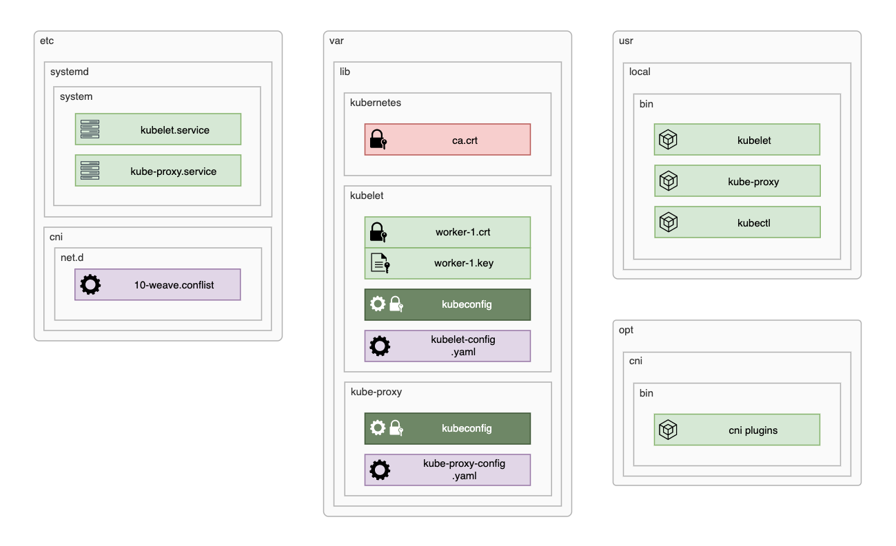

# Bootstrapping the worker nodes components

- [Install binaries and copy certificate files](#install-binaries-and-copy-certificate-files)
- [Kubelet](#kubelet)
  - [kubeconfig, kubelet-config.yaml and the systemd unit file](#kubeconfig-kubelet-configyaml-and-the-systemd-unit-file)
- [Kube-proxy](#kube-proxy)
  - [kubeconfig, kube-proxy-config.yaml and the systemd unit file](#kubeconfig-kube-proxy-configyaml-and-the-systemd-unit-file)
  - [Authorise kubectl, daemon startup and verifications](#authorise-kubectl-daemon-startup-and-verifications)
- [Networking](#networking)
  - [CNI Framework](#cni-framework)
  - [Weave CNI Plugin and CoreDNS](#weave-cni-plugin-and-coredns)



## Install binaries and copy certificate files

    WORKER NODES ↴

```bash
{
cd ~
# Get worker node hostname
NODE_HOSTNAME=$(hostname -s)

# Create the required folders
sudo mkdir -p \
  /var/lib/kubelet \
  /var/lib/kube-proxy \
  /var/lib/kubernetes \
  /opt/cni/bin/


# Dowload binary files
wget -q --show-progress --https-only --timestamping \
  https://storage.googleapis.com/kubernetes-release/release/v1.13.0/bin/linux/amd64/kube-proxy \
  https://storage.googleapis.com/kubernetes-release/release/v1.13.0/bin/linux/amd64/kubelet


# Mark as executables and move to correct location
chmod +x kube-proxy kubelet
sudo mv kube-proxy kubelet /usr/local/bin/

# Copy certificate files to their location
cd ~/share
sudo cp ca.crt /var/lib/kubernetes/
sudo cp ${NODE_HOSTNAME}.key ${NODE_HOSTNAME}.crt /var/lib/kubelet/

}
```

## Kubelet

### kubeconfig, kubelet-config.yaml and the systemd unit file

    WORKER NODES ↴

    Generates (each node): worker-1-kubelet.kubeconfig, kubelet-config.yaml, kubelet.service

```bash
{
cd ~/share

# Get worker node hostname
NODE_HOSTNAME=$(hostname -s)


# Generate the workers kubeconfig file
kubectl config set-cluster kubernetes-the-hard-way \
  --certificate-authority=ca.crt \
  --embed-certs=true \
  --server=https://${LB_IP}:6443 \
  --kubeconfig=${NODE_HOSTNAME}-kubelet.kubeconfig

kubectl config set-credentials system:node:${NODE_HOSTNAME} \
  --client-certificate=${NODE_HOSTNAME}.crt \
  --client-key=${NODE_HOSTNAME}.key \
  --embed-certs=true \
  --kubeconfig=${NODE_HOSTNAME}-kubelet.kubeconfig

kubectl config set-context default \
  --cluster=kubernetes-the-hard-way \
  --user=system:node:${NODE_HOSTNAME} \
  --kubeconfig=${NODE_HOSTNAME}-kubelet.kubeconfig

kubectl config use-context default --kubeconfig=${NODE_HOSTNAME}-kubelet.kubeconfig


# Copy the kubeconfig file to correct location
sudo cp ${NODE_HOSTNAME}-kubelet.kubeconfig /var/lib/kubelet/kubeconfig


# Generate the kubelet-config.yaml configuration file
cat <<EOF | sudo tee /var/lib/kubelet/kubelet-config.yaml
kind: KubeletConfiguration
apiVersion: kubelet.config.k8s.io/v1beta1
authentication:
  anonymous:
    enabled: false
  webhook:
    enabled: true
  x509:
    clientCAFile: "/var/lib/kubernetes/ca.crt"
authorization:
  mode: Webhook
clusterDomain: "cluster.local"
clusterDNS:
  - "10.96.0.10"
resolvConf: "/run/systemd/resolve/resolv.conf"
runtimeRequestTimeout: "15m"
EOF


# Generate the kubelet.service systemd unit file
cat <<EOF | sudo tee /etc/systemd/system/kubelet.service
[Unit]
Description=Kubernetes Kubelet
Documentation=https://github.com/kubernetes/kubernetes
After=docker.service
Requires=docker.service

[Service]
ExecStart=/usr/local/bin/kubelet \\
  --config=/var/lib/kubelet/kubelet-config.yaml \\
  --image-pull-progress-deadline=2m \\
  --kubeconfig=/var/lib/kubelet/kubeconfig \\
  --tls-cert-file=/var/lib/kubelet/${NODE_HOSTNAME}.crt \\
  --tls-private-key-file=/var/lib/kubelet/${NODE_HOSTNAME}.key \\
  --network-plugin=cni \\
  --register-node=true \\
  --v=2
Restart=on-failure
RestartSec=5

[Install]
WantedBy=multi-user.target
EOF

}
```

## Kube-proxy

### kubeconfig, kube-proxy-config.yaml and the systemd unit file

    WORKER NODES ↴

    Generates: kube-proxy-config.yaml, kubelet.service

```bash
{
cd ~/share

# Set the cluste CIDR address
CLUSTER_CIDR="192.168.2.0/24"


# Copy the kubeconfig file to correct location
sudo cp kube-proxy.kubeconfig /var/lib/kube-proxy/kubeconfig


# Generate the kubelet-config.yaml configuration file
cat <<EOF | sudo tee /var/lib/kube-proxy/kube-proxy-config.yaml
kind: KubeProxyConfiguration
apiVersion: kubeproxy.config.k8s.io/v1alpha1
clientConnection:
  kubeconfig: "/var/lib/kube-proxy/kubeconfig"
mode: "iptables"
clusterCIDR: "${CLUSTER_CIDR}"
EOF


# Generate the kubelet.service systemd unit file
cat <<EOF | sudo tee /etc/systemd/system/kube-proxy.service
[Unit]
Description=Kubernetes Kube Proxy
Documentation=https://github.com/kubernetes/kubernetes

[Service]
ExecStart=/usr/local/bin/kube-proxy \\
  --config=/var/lib/kube-proxy/kube-proxy-config.yaml
Restart=on-failure
RestartSec=5

[Install]
WantedBy=multi-user.target
EOF

}
```

### Authorise kubectl, daemon startup and verifications

    WORKER NODES ↴

```bash
{
cd ~/share

# Get the Load Balancer IP
LB_IP="192.168.2.10"

kubectl config set-cluster kubernetes-the-hard-way \
  --certificate-authority=ca.crt \
  --embed-certs=true \
  --server=https://${LB_IP}:6443

kubectl config set-credentials admin \
  --client-certificate=admin.crt \
  --client-key=admin.key

kubectl config set-context kubernetes-the-hard-way \
  --cluster=kubernetes-the-hard-way \
  --user=admin

kubectl config use-context kubernetes-the-hard-way


# Startdup kubelet and kube-proxy deamons
sudo systemctl daemon-reload && \
sudo systemctl enable kubelet kube-proxy && \
sudo systemctl restart kubelet kube-proxy
sleep 5

kubectl get componentstatuses
kubectl get nodes
}

```

## Networking

### CNI Framework

    WORKER NODES ↴

```bash
{
cd ~/share

# Download, unpack and move file to correct location
wget https://github.com/containernetworking/plugins/releases/download/v0.7.5/cni-plugins-amd64-v0.7.5.tgz
sudo tar -xzvf cni-plugins-amd64-v0.7.5.tgz --directory /opt/cni/bin/
rm cni-plugins-amd64-v0.7.5.tgz

}
```

### Weave CNI Plugin and CoreDNS

    LB NODE ↴

```bash
{
cd ~/share

# Add Weave networking pluging
kubectl apply -f "https://cloud.weave.works/k8s/net?k8s-version=$(kubectl version | base64 | tr -d '\n')"

# Add CoreDNS
kubectl apply -f https://raw.githubusercontent.com/mmumshad/kubernetes-the-hard-way/master/deployments/coredns.yaml
sleep 5

# Verifycation
kubectl get pods -n kube-system -owide
}
```
