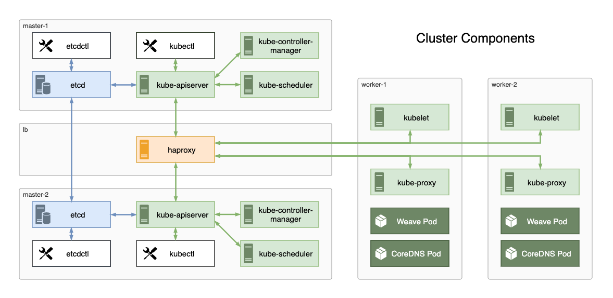

# An overview of the various components and their relations

- [Control Plane components](#control-plane-components)
- [Worker Node components](#worker-node-components)
- [HA & Load balancing](#ha--load-balancing)
- [Networking](#networking)
- [Command line tools](#command-line-tools)

## Control Plane components

In Kubernetes everything revolves around the API server component, called the `kube-apiserver`. With one small exception, `kube-apiserver` is the only server component in the cluster. All the other components connect to it. The exception is the `kubelet` which also accepts incomming connections from the `kube-apiserver` for pulls metrics, logs and executing commands inside the pods.

The `kube-controller-manager` is a collection of controllers built into a single binary file. It runs a control loop which monitors the shared state of the cluster and takes actions to maintain that state. Some examples include the replication controller, namespace controller or the endpoints controller. This component communicates with the `kube-apiserver` using TLS, with the signed certificate and key embeded in the associated `kube-controller-manager.kubeconfig` file.

The `kube-scheduler` is the component responsible for figuring out which node a particular pod should be deployed on by taking into account various parameteres such as resource requirements, tains and node affinity. As the rest of components, it al connects to the `kube-api` server by TLS, with certificate and key embeded into the `kube-scheduler.kubeconfig` file, passed as a parameter during daemon startup.

`etcd` is the data store used exclusevly by the `kube-apiserver` to save the cluster state. It is not part of the official Kubernetes distribution by an essetial part of the cluster. Communication is also TLS based with the exception that certificates are not embedded, but passed as parametters at startup. `etcd` runs in HA cluster mode using a leader elect process.

## Worker Node components

On the worker node there are two main components, both running as system daemons on each node.

The `kubelet` is the Kubernetes agent and is reponsible for managing pods through their entire lifecycle. The `kubelet` connects to the `kube-apiserver` via TLS with node unique certificates embedded inside `kubeconfig` files on each node.

The role of the `kube-proxy` component is to provide network conectivity to pods in the cluster by adjusting the iptables rules of the host node.

## HA & Load balancing

Traffic to the two instances of `kube-apiserver` on each of the master nodes is mediated by a load balancer provisioned on the lb node. This is to illustrate how Kubernetes can function in HA mode. It must be noted that Kubernetes needs at least 3 master nodes to maintain quorum in the event of a node failure, but the setup is identical. We keep only 2 master nodes for simplicity here.

A copy of `etcd` server is also deployed on each master node, configured as a cluster. The `etcd` instances go trough a process of leader election to ensure data consistency. As with `kube-apiserver` it would need at least 3 instances to maintain quorum in the event of a node failure in a production environment.

## Networking

Networking in Kubernetes is achieved through the use of Kubrnetes CNI framwork whose binaries need to be installed on every worker node. On top of that, we will install the Weave CNI plugin to provide pod-to-pod network conectivity and OpenDNS for service discovery. These will be deployed as running PODs rather than system daemons and their lifecycle will be managed by Kubernetes.

## Command line tools

`kubectl` is the main command line tool for interacting with the `kube-apiserver`. It can be setup to access the cluster remotely through the use of a set of signed certificates issued to a user in the `system:admin` group, embedded into a kubeconfig file. We will use `admin.kubeconfig` to store this configuration.

`etcdctl` as the name suggests, is the command line tool for interacting with the etcd server / cluster.