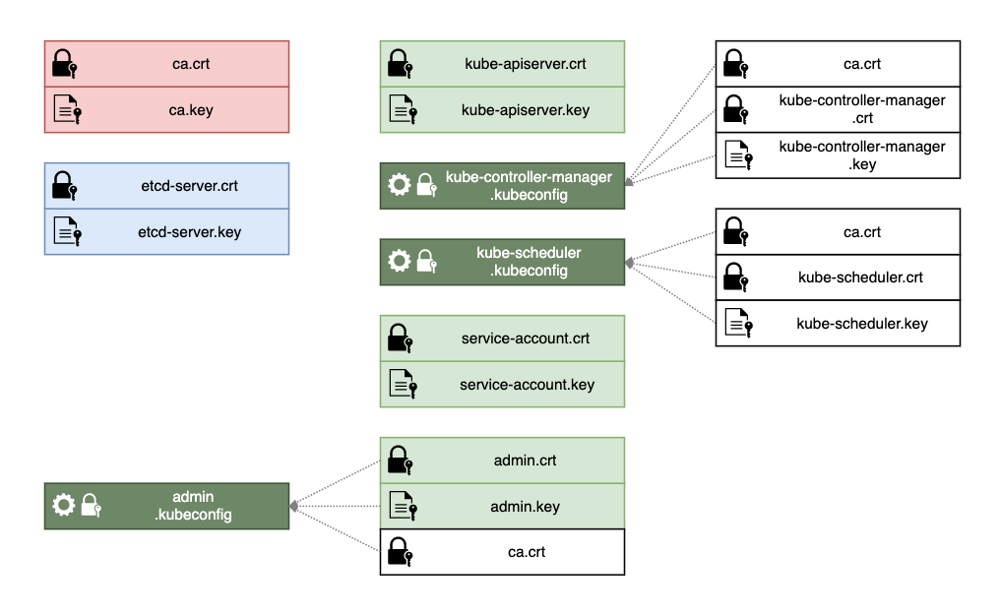
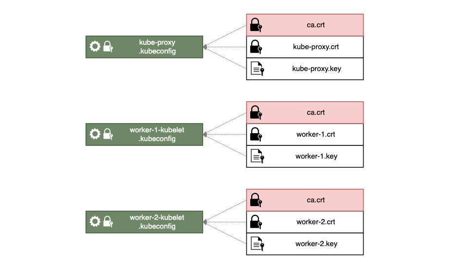

# Authorisation, TLS Certificates and Kubeconfig

- [Install kubectl on all nodes](#install-kubectl-on-all-nodes)
- [Generate the CA certificate and key](#generate-the-ca-certificate-and-key)
- [Generate keys, signed certificated and kubeconfig files for the control plane](#generate-keys-signed-certificated-and-kubeconfig-files-for-the-control-plane)
  - [**etcd**](#etcd)
  - [**kube-apiserver**](#kube-apiserver)
  - [**kube-controller-manager**](#kube-controller-manager)
  - [**kube-scheduler**](#kube-scheduler)
  - [**service-accounts**](#service-accounts)
  - [**admin**](#admin)
  - [**EncryptionConfig**](#encryptionconfig)
- [Generate keys, signed certificated and kubeconfig files for the worker nodes](#generate-keys-signed-certificated-and-kubeconfig-files-for-the-worker-nodes)
  - [**kube-proxy**](#kube-proxy)
  - [**kubelet**](#kubelet)

Components in Kubernetes communicate securely over TLS. Kuberneted doesn't have built in user management. Instead it relies on certificates being signed by a trusted CA.

`etcd` and `kube-apiserver` both link to certificate files using command line parameters during daemon startup. The other components embded the certificates into special authorisation files called `kubeconfig`, alongside cluster and user information.

In order to generate the `kubeconfig` files, the `kubectl` utility needs to be installed first.

In this section we will:
After installing the `kubectl` utility on all nodes, to help create the `kubeconfig` files we will proceed to generating:

- a self signed CA certificate and key pair
- keys, signed certificates and kubeconfig files for the control plane componentes
- keys, signed certificates and kubeconfig filesfor the worker nodes

## Install kubectl on all nodes

The Kubernetes command line tool, among other things, will facilitate the creation of kubeconfig files, so it needs to be installed first. Since will use this tool at various stages of the installation, we will be installing on every node in the cluster.

    ALL NODES ↴

```bash
{
cd ~

# Download kubectl binary file, mark it as executable and move to correct location
wget https://storage.googleapis.com/kubernetes-release/release/v1.13.0/bin/linux/amd64/kubectl
chmod +x kubectl
sudo mv kubectl /usr/local/bin/

# Verify installation
kubectl version --client

}
```

## Generate the CA certificate and key

This certificate will be used to sign all other certificates for the cluster. Every certificate signed by the CA will be trusted by the Kubernetes cluster, so the private key must be kept secure.

With the exception of the the kubelet certificates which have to be issued for each node, the other certificates need to be generated once and distributed to their correct location. We'll distribute them in the following section when we approach the configuration of one component at a time. We will use the `LB node` to generate the keys and signed certificates under `~/share` folder as this will make it easier to distribute them later.

    LB NODE ↴

    Generates: ca.key, ca.crt

```bash
{
cd ~/share

# Create private key for CA
openssl genrsa -out ca.key 2048

# Create a certificate signing request (CSR) using the private key
# The CA for this cluster will be named KUBERNETES-CA
openssl req -new -key ca.key -subj "/CN=KUBERNETES-CA" -out ca.csr

# Self sign the csr using its own private key
openssl x509 -req -in ca.csr -signkey ca.key -CAcreateserial -out ca.crt -days 1000

# Cleanup, remove the signing request as is no longer needed
rm *.csr

}
```

## Generate keys, signed certificated and kubeconfig files for the control plane



### **etcd**

In HA configuration, the etcd server will be access using both master nodes addresses. For this reason, we need to specify all alternative names and IP in a separe openssl configuration file.

    LB NODE ↴

    Will generate: etcd-server.key, etcd-server.crt

```bash
{
cd ~/share

# Define IP Addresses for the master servers
MASTER_1_IP="192.168.2.11"
MASTER_2_IP="192.168.2.12"

# Create openssl.conf to include all names and IP for the certificate
cat > openssl-etcd-server.conf <<EOF
[req]
req_extensions = v3_req
distinguished_name = req_distinguished_name
[req_distinguished_name]
[ v3_req ]
basicConstraints = CA:FALSE
keyUsage = nonRepudiation, digitalSignature, keyEncipherment
subjectAltName = @alt_names
[alt_names]
IP.1 = ${MASTER_1_IP}
IP.2 = ${MASTER_2_IP}
IP.3 = 127.0.0.1
EOF

# Create private key, certificate signing request and signed certificate for the etcd cluster
openssl genrsa -out etcd-server.key 2048
openssl req -new -key etcd-server.key -subj "/CN=etcd-server" -out etcd-server.csr -config openssl-etcd-server.conf
openssl x509 -req -in etcd-server.csr -CA ca.crt -CAkey ca.key -CAcreateserial -out etcd-server.crt -extensions v3_req -extfile openssl-etcd-server.conf -days 1000

# Cleanup
rm *.csr *.conf

}
```

### **kube-apiserver**

Just as the etcd sever, the `kube-apiserver` will be accessed by different names and IP addresses. Will specify these in a separate openssl configuration file.

    LB NODE ↴

    Will generate: kube-apiserver.key, kube-apiserver.crt

```bash
{
cd ~/share

# Define IP Addresses for the load balancer and master servers
LB_IP="192.168.2.10"
MASTER_1_IP="192.168.2.11"
MASTER_2_IP="192.168.2.12"

# Create openssl.conf to include all names and IP for the certificate
cat > openssl-kube-apiserver.conf <<EOF
[req]
req_extensions = v3_req
distinguished_name = req_distinguished_name
[req_distinguished_name]
[ v3_req ]
basicConstraints = CA:FALSE
keyUsage = nonRepudiation, digitalSignature, keyEncipherment
subjectAltName = @alt_names
[alt_names]
DNS.1 = kubernetes
DNS.2 = kubernetes.default
DNS.3 = kubernetes.default.svc
DNS.4 = kubernetes.default.svc.cluster.local
IP.1 = 10.96.0.1
IP.2 = ${LB_IP}
IP.3 = ${MASTER_1_IP}
IP.4 = ${MASTER_2_IP}
IP.5 = 127.0.0.1
EOF

# Generate private key and signed certificate for the api server
openssl genrsa -out kube-apiserver.key 2048
openssl req -new -key kube-apiserver.key -subj "/CN=kube-apiserver" -out kube-apiserver.csr -config openssl-kube-apiserver.conf
openssl x509 -req -in kube-apiserver.csr -CA ca.crt -CAkey ca.key -CAcreateserial -out kube-apiserver.crt -extensions v3_req -extfile openssl-kube-apiserver.conf -days 1000

# Cleanup
rm *.csr *.conf

}
```

### **kube-controller-manager**

The `kube-controller-manager` uses a `kubeconfig` file which embedds the key, signed certificate and the ca certificate for authentication to the `kube-apiserver`. Will will first generate the key and signed certificate, and then the kubeconfig file.

    LB NODE ↴

    Will generate: kube-controller-manager.kubeconfig

```bash
{
cd ~/share

# Generate private key and signed certificate for the kube-controller-manager
openssl genrsa -out kube-controller-manager.key 2048
openssl req -new -key kube-controller-manager.key -subj "/CN=system:kube-controller-manager" -out kube-controller-manager.csr
openssl x509 -req -in kube-controller-manager.csr -CA ca.crt -CAkey ca.key -CAcreateserial -out kube-controller-manager.crt -days 1000

# Generate the kubeconfig file with embedded certificates
kubectl config set-cluster kubernetes-the-hard-way \
  --certificate-authority=ca.crt \
  --embed-certs=true \
  --server=https://127.0.0.1:6443 \
  --kubeconfig=kube-controller-manager.kubeconfig

kubectl config set-credentials system:kube-controller-manager \
  --client-certificate=kube-controller-manager.crt \
  --client-key=kube-controller-manager.key \
  --embed-certs=true \
  --kubeconfig=kube-controller-manager.kubeconfig

kubectl config set-context default \
  --cluster=kubernetes-the-hard-way \
  --user=system:kube-controller-manager \
  --kubeconfig=kube-controller-manager.kubeconfig

kubectl config use-context default --kubeconfig=kube-controller-manager.kubeconfig

# Cleanup
rm kube-controller-manager*.!(kubeconfig)
}
```

### **kube-scheduler**

The same applies for `kube-scheduler`. We first generate the key and signed certificate, then we embed them into a kubeconfig file.

    LB NODE ↴

    Will generate: kube-scheduler.kubeconfig

```bash
{
cd ~/share

# Generate private key and signed certificate for the kube-scheduler
openssl genrsa -out kube-scheduler.key 2048
openssl req -new -key kube-scheduler.key -subj "/CN=system:kube-scheduler" -out kube-scheduler.csr
openssl x509 -req -in kube-scheduler.csr -CA ca.crt -CAkey ca.key -CAcreateserial  -out kube-scheduler.crt -days 1000

# Generate the kubeconfig file with embedded certificates
kubectl config set-cluster kubernetes-the-hard-way \
  --certificate-authority=ca.crt \
  --embed-certs=true \
  --server=https://127.0.0.1:6443 \
  --kubeconfig=kube-scheduler.kubeconfig

kubectl config set-credentials system:kube-scheduler \
  --client-certificate=kube-scheduler.crt \
  --client-key=kube-scheduler.key \
  --embed-certs=true \
  --kubeconfig=kube-scheduler.kubeconfig

kubectl config set-context default \
  --cluster=kubernetes-the-hard-way \
  --user=system:kube-scheduler \
  --kubeconfig=kube-scheduler.kubeconfig

kubectl config use-context default --kubeconfig=kube-scheduler.kubeconfig

# Cleanup
rm kube-scheduler*.!(kubeconfig)
}
```

### **service-accounts**

`kube-controller-manager` uses this certificate to generate and sign service account tokens.

    LB NODE ↴

    Will generate: service-account.key, service-account.crt

```bash
{
cd ~/share

# Generate private key and signed certificate for the service-account
openssl genrsa -out service-account.key 2048
openssl req -new -key service-account.key -subj "/CN=service-accounts" -out service-account.csr
openssl x509 -req -in service-account.csr -CA ca.crt -CAkey ca.key -CAcreateserial  -out service-account.crt -days 1000

# Cleanup
rm *.csr
}
```

### **admin**

This certificate will be used by the admin user for remote access to the cluster via `kubectl`

    LB NODE ↴

    Will generate: admin.key, admin.crt

```bash
{
cd ~/share

# Get the IP address of the load lanacer
LB_IP="192.168.2.10"

# Generate private key and signed certificate for the service-account
openssl genrsa -out admin.key 2048
openssl req -new -key admin.key -subj "/CN=admin/O=system:masters" -out admin.csr
openssl x509 -req -in admin.csr -CA ca.crt -CAkey ca.key -CAcreateserial  -out admin.crt -days 1000


# Generate a kubeconfig auth file for the admin user
kubectl config set-cluster kubernetes-the-hard-way \
  --certificate-authority=ca.crt \
  --embed-certs=true \
  --server=https://${LB_IP}:6443 \
  --kubeconfig=admin.kubeconfig

kubectl config set-credentials admin \
  --client-certificate=admin.crt \
  --client-key=admin.key \
  --kubeconfig=admin.kubeconfig

kubectl config set-context kubernetes-the-hard-way \
  --cluster=kubernetes-the-hard-way \
  --user=admin \
  --kubeconfig=admin.kubeconfig

kubectl config use-context kubernetes-the-hard-way --kubeconfig=admin.kubeconfig


# Cleanup
rm *.csr
}
```

### **EncryptionConfig**

    LB NODE ↴

    Will generate: enctyption-config.yaml

```bash
{
cd ~/share

ENCRYPTION_KEY=$(head -c 32 /dev/urandom | base64)
cat > encryption-config.yaml <<EOF
kind: EncryptionConfig
apiVersion: v1
resources:
  - resources:
      - secrets
    providers:
      - aescbc:
          keys:
            - name: key1
              secret: ${ENCRYPTION_KEY}
      - identity: {}
EOF

}
```

## Generate keys, signed certificated and kubeconfig files for the worker nodes



### **kube-proxy**

`kube-proxy` uses only one pair of credentials for all nodes. As with `kubelet` above, certificates will be generated using an external openssl configuration file and will be embedded into the final kubeconfig.

    LB NODE ↴

    Will generate: kube-proxy.kubeconfig

```bash
{

cd ~/share

# Generate the key and signed certificate
openssl genrsa -out kube-proxy.key 2048
openssl req -new -key kube-proxy.key -subj "/CN=system:kube-proxy" -out kube-proxy.csr
openssl x509 -req -in kube-proxy.csr -CA ca.crt -CAkey ca.key -CAcreateserial  -out kube-proxy.crt -days 1000

# Generate the kubeconfig file by embedding the certificates and cluster information
kubectl config set-cluster kubernetes-the-hard-way \
  --certificate-authority=ca.crt \
  --embed-certs=true \
  --server=https://${LB_IP}:6443 \
  --kubeconfig=kube-proxy.kubeconfig

kubectl config set-credentials system:kube-proxy \
  --client-certificate=kube-proxy.crt \
  --client-key=kube-proxy.key \
  --embed-certs=true \
  --kubeconfig=kube-proxy.kubeconfig

kubectl config set-context default \
  --cluster=kubernetes-the-hard-way \
  --user=system:kube-proxy \
  --kubeconfig=kube-proxy.kubeconfig

kubectl config use-context default --kubeconfig=kube-proxy.kubeconfig

# Cleanup
rm kube-proxy*.!(kubeconfig)

}
```

### **kubelet**

Each `kubelet` instance will have its own signed certificate and key pair, unique for each node. As with `kube-controller-manager` and `kube-scheduler`, the certificates will be embeded into kubeconfig files for each node. Kubelets are reached by IP or DNS name, so both will be added to the certificate by using a openssl configuration file.

Because the kubelets certificates include both IPs and Hostname information, we will be generating them on the worker nodes, but save them in the same ~/share folder for now.

    WORKER NODES ↴

    Will generate:
      worker-1.crt, worker-1.key, worker-2.crt, worker-2.key
      worker-1-kubelet.kubeconfig, worker-2-kubelet.kubeconfig

```bash
{
cd ~/share

WORKER_HOSTNAME=$(hostname -s)
WORKER_IP=$(hostname -I | awk '{ print $2 }')
LB_IP="192.168.2.10"

# Create openssl.conf to include all the hostname and IP for the node
cat > ${WORKER_HOSTNAME}-openssl.conf <<EOF
[req]
req_extensions = v3_req
distinguished_name = req_distinguished_name
[req_distinguished_name]
[ v3_req ]
basicConstraints = CA:FALSE
keyUsage = nonRepudiation, digitalSignature, keyEncipherment
subjectAltName = @alt_names
[alt_names]
DNS.1 = ${WORKER_HOSTNAME}
IP.1 = ${WORKER_IP}
EOF

# Generate the key and signed certificate
openssl genrsa -out ${WORKER_HOSTNAME}.key 2048
openssl req -new -key ${WORKER_HOSTNAME}.key -subj "/CN=system:node:${WORKER_HOSTNAME}/O=system:nodes" -out ${WORKER_HOSTNAME}.csr -config ${WORKER_HOSTNAME}-openssl.conf
openssl x509 -req -in ${WORKER_HOSTNAME}.csr -CA ca.crt -CAkey ca.key -CAcreateserial -out ${WORKER_HOSTNAME}.crt -extensions v3_req -extfile ${WORKER_HOSTNAME}-openssl.conf -days 1000

# Generate the kubeconfig file by embedding the certificates and cluster information
kubectl config set-cluster kubernetes-the-hard-way \
  --certificate-authority=ca.crt \
  --embed-certs=true \
  --server=https://${LB_IP}:6443 \
  --kubeconfig=${WORKER_HOSTNAME}-kubelet.kubeconfig

kubectl config set-credentials system:node:${WORKER_HOSTNAME} \
  --client-certificate=${WORKER_HOSTNAME}.crt \
  --client-key=${WORKER_HOSTNAME}.key \
  --embed-certs=true \
  --kubeconfig=${WORKER_HOSTNAME}-kubelet.kubeconfig

kubectl config set-context default \
  --cluster=kubernetes-the-hard-way \
  --user=system:node:${WORKER_HOSTNAME} \
  --kubeconfig=${WORKER_HOSTNAME}-kubelet.kubeconfig

kubectl config use-context default --kubeconfig=${WORKER_HOSTNAME}-kubelet.kubeconfig

# Cleanup
rm ${WORKER_HOSTNAME}*.conf ${WORKER_HOSTNAME}*.csr

}
```
